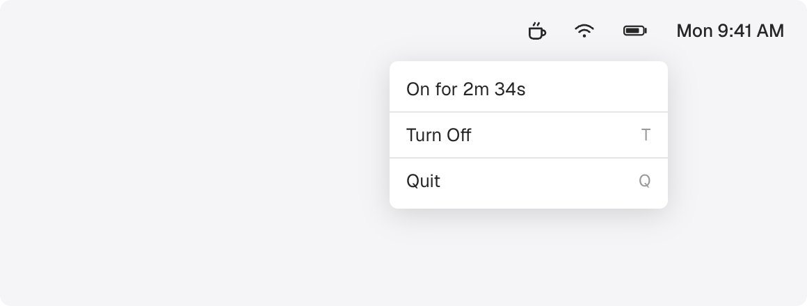

# Caffeinate Toggle

A macOS menu bar app that toggles `caffeinate -d` (prevent display sleep) on and off.




- Custom cup icon shows state at a glance (outline = off, steam = on)
- Shows how long caffeinate has been active
- Detects existing caffeinate processes on launch
- Lives in the menu bar only (no dock icon)

## Install

Download the latest `.zip` from [Releases](https://github.com/trakce01/caffeinate-toggle/releases), unzip, and drag to Applications.

## Build from source

```
git clone https://github.com/trakce01/caffeinate-toggle.git
cd caffeinate-toggle
./build.sh
```

Installs to `~/Applications/Caffeinate Toggle.app`. Requires Swift 5.9+ and macOS 13+.
